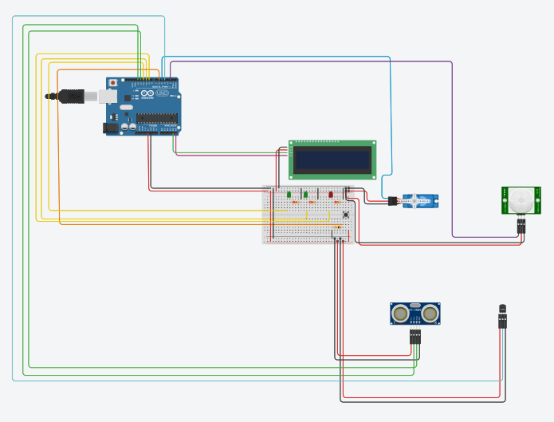
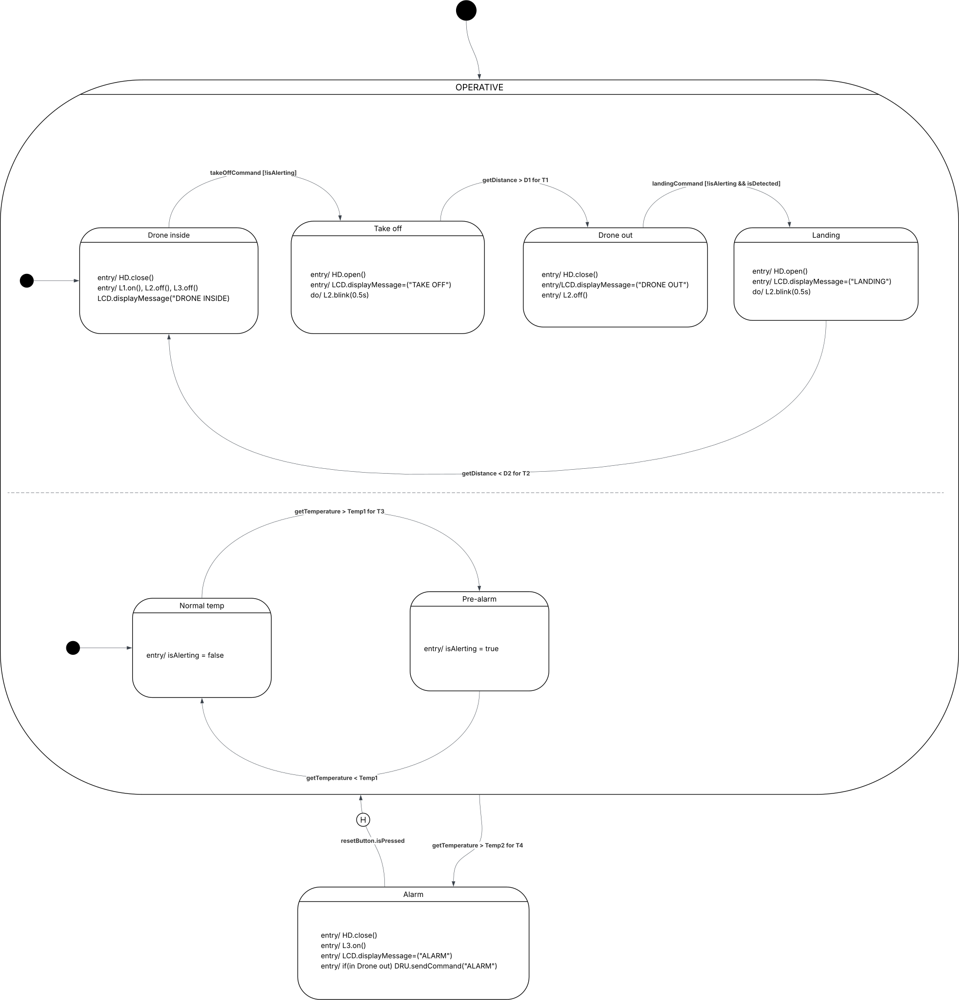

# 🚁 Smart Drone Hangar

> An Arduino-based smart hangar system with a Java dashboard — automated door control, temperature monitoring, and real-time drone communication over serial.


---

## What is Smart Drone Hangar?

**Smart Drone Hangar** is an embedded system that automates the management of a drone hangar. It handles door control during take-off and landing, monitors internal temperature for safety, and communicates in real time with a PC-side Java dashboard (**Drone Remote Unit**) over a serial connection.

The system is split into two subsystems:
- **Drone Hangar** — Arduino-based embedded controller
- **Drone Remote Unit (DRU)** — Java GUI running on PC, simulating the drone bridge

### Hardware components
- PIR sensor — drone presence detection
- Sonar — drone distance measurement inside the hangar
- Servo motor — hangar door control
- Analog temperature sensor
- I²C LCD display
- 2 green LEDs (L1, L2) + 1 red LED (L3)
- Reset tactile button

---

## Behaviour Overview

**At startup** the door is closed, drone is assumed inside. L1 is on, LCD shows `DRONE INSIDE`.

**Take-off** — the drone sends an open command via DRU. The door opens, LCD shows `TAKE OFF`. Once the sonar detects the drone has cleared the hangar for long enough, the door closes and LCD shows `DRONE OUT`.

**Landing** — the drone sends an open command. If the PIR detects presence, the door opens and LCD shows `LANDING`. Once the sonar confirms the drone has landed and held position, the door closes and LCD shows `DRONE INSIDE`.

During take-off and landing, **L2 blinks** at 0.5s period.

**Temperature monitoring** is active whenever the drone is inside:
- Above threshold `Temp1` for too long → **pre-alarm**: new take-offs/landings suspended.
- Above threshold `Temp2` for too long → **full alarm**: door closes, L3 turns on, LCD shows `ALARM`. If the drone is outside, the alarm is also sent via DRU. All operations suspended until the **RESET** button is pressed by an operator.

---

## Project Architecture

The Arduino firmware is designed around a **task-based architecture** with **synchronous Finite State Machines**. Each concern is isolated into its own task, scheduled cooperatively by a lightweight kernel.

```
.
├── arduino/DroneHangar/src/
│   ├── config.h                    # Tunable parameters (distances, timings, temps)
│   ├── main.cpp                    # Entry point, scheduler setup
│   ├── devices/                    # Hardware abstraction layer
│   │   ├── Button.h / ButtonImpl   # Tactile button
│   │   ├── Led.h / Led.cpp         # LED control
│   │   ├── Light.h                 # Light interface
│   │   ├── DisplayLcd              # I²C LCD display
│   │   ├── HangarDoor              # Servo motor door control
│   │   ├── Pir / PresenceSensor    # PIR presence detection
│   │   ├── Sonar / ProximitySensor # Ultrasonic distance sensing
│   │   └── TempSensor              # Analog temperature sensor
│   ├── kernel/                     # Cooperative task scheduler
│   │   ├── Scheduler               # Task scheduling loop
│   │   ├── Task.h                  # Base task interface
│   │   ├── MsgService              # Inter-task messaging
│   │   └── Logger                  # Debug logging
│   ├── model/                      # Shared system state
│   │   ├── Context                 # Global state context
│   │   └── HangarPlatform          # Platform abstraction
│   └── tasks/                      # FSM tasks
│       ├── MainHangarTask          # Core hangar FSM (door, drone states)
│       ├── AlarmTask               # Temperature alarm FSM
│       ├── BlinkingLedTask         # L2 blink control
│       └── SerialTask              # Serial communication with DRU
│
└── java/DroneRemoteUnit/src/
    ├── DashboardLauncher.java      # Entry point
    ├── DashboardView.java          # Main GUI window
    ├── DashboardController.java    # UI logic and state
    ├── CommChannel.java            # Communication interface
    ├── SerialCommChannel.java      # Serial port implementation (jssc)
    ├── MonitoringAgent.java        # Background serial listener
    ├── HistoryView.java            # Event history panel
    └── LogView.java                # Raw log panel
```

### Task Componenti

| Task | Periodo | Funzione |
|------|---------|----------|
| `MainHangarTask` | 200ms | Core hangar FSM (door, drone states) |
| `BlinkingLedTask` | 200ms | L2 blink control during take-off/landing |
| `AlarmTask` | 100ms | Temperature monitoring and alarm FSM |
| `SerialTask` | 500ms | Serial communication with DRU |

### State Machine

| State | Description |
|-------|-------------|
| `IDLE_INSIDE` | Drone idle inside the hangar |
| `TAKING_OFF` | Drone taking off |
| `CHECK_TAKING_OFF` | Verify take-off complete |
| `OUTSIDE` | Drone outside hangar |
| `LANDING` | Drone landing |
| `CHECK_LANDING` | Verify landing complete |

### Serial Protocol

| Arduino → PC | Description |
|--------------|-------------|
| `DIST:<distance>` | Current sonar distance |
| `STATE:<state>` | Current drone state |
| `ALARM:<0|1>` | Temperature alarm state |
| `PREALARM:<0|1>` | Temperature pre-alarm state |
| `TEMP:<temperature>` | Current temperature |
| `DOOR:<OPEN\|CLOSED>` | Door state |

| PC → Arduino | Description |
|--------------|-------------|
| `TAKEOFF` | Request take-off |
| `LAND` | Request landing |

### UML Diagrams

- [Lucidchart - Complete diagrams](https://lucid.app/lucidchart/5d4fabe1-c16f-4353-b877-1f1fa4a3f847)

State UML diagram: 

---

## Display Support

| Display | Library |
|---|---|
| LCD 1602 | `LiquidCrystal_I2C.h` |
| SH1106 OLED | `U8g2lib.h` |

**To switch to OLED**, set the build flag in `platformio.ini`:

```ini
build_flags = -D USE_OLED
```

---

## Build & Flash

### Arduino (PlatformIO)

```bash
cd arduino/DroneHangar
pio run --target upload
```

### Java Dashboard

```bash
cd java/DroneRemoteUnit
./build.sh
```

Requires Java and the bundled `jssc-2.9.4.jar` (already in `lib/`). Make sure to select the correct serial port in the dashboard UI.

---

## Authors

- Arthur Istvan Muller (Matricola: 0001145303)
- Giuseppe Cattolico (Matricola: 0001124318)
